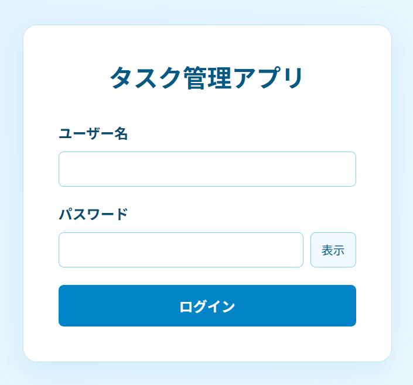
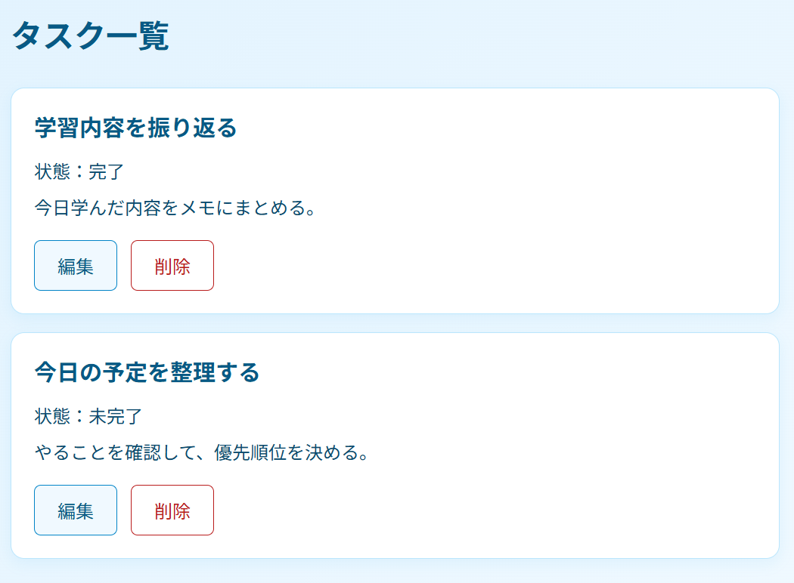
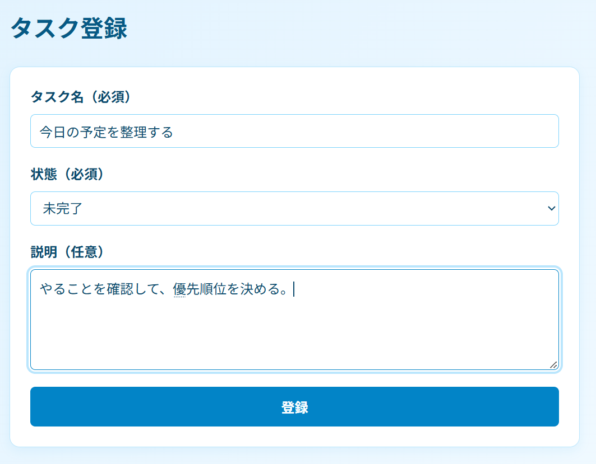
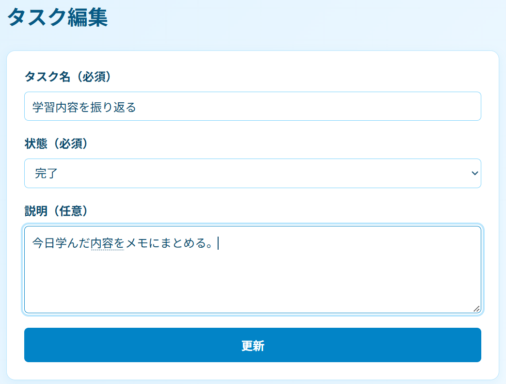
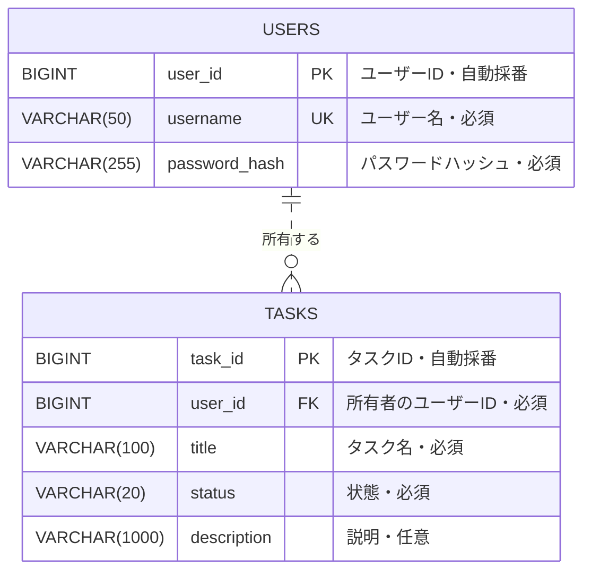
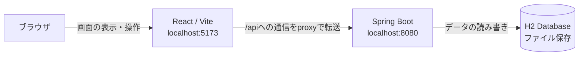

# タスク管理アプリ

自分のタスクを、登録から完了までまとめて管理するWebアプリケーションです。

## 概要

個人の日々の作業や予定をタスクとして登録し、状態を「未完了」「完了」で管理できます。
ログインしたユーザーは、自分のタスクの一覧表示・登録・編集・削除を行えます。

Reactで画面を作成し、Spring BootのREST APIを通してH2 Databaseへデータを保存します。
タスクの所有者はサーバー側で判定し、他のユーザーのタスクにはアクセスできないようにしています。

## 公開状況

- ソースコード：GitHubで公開
- アプリケーション：ローカル環境で動作確認済み
- 本番環境へのデプロイ：未実施

GitHubリポジトリ：
https://github.com/kuni7588/task-management-app

ローカルでの起動方法は、後述の「ローカルでの起動方法」を参照してください。

## 開発背景

自分自身、やるべきことを整理したり、タスクを管理したりすることが苦手だったため、このアプリを開発しました。

その日に取り組みたいことをタスクとして登録し、一覧で見えるようにすることで、やるべきことを視覚的に思い出せるようにしたいと考えました。
同じようにタスク管理に難しさを感じている人にも、使いやすいアプリを目指しました。

「シンプルであること」を大切にし、機能を一覧表示・登録・編集・削除に絞りました。
画面は空色と白を基調にして、タスク名や状態を見やすく表示しています。

## 使用技術

| 分類           | 技術                              | 用途                               |
| -------------- | --------------------------------- | ---------------------------------- |
| フロントエンド | JavaScript・React                 | ログイン画面とタスク管理画面の実装 |
| フロントエンド | Vite                              | 開発サーバーとビルド               |
| デザイン       | CSS                               | 空色・白色を基調にした画面デザイン |
| バックエンド   | Java・Spring Boot                 | REST APIと業務処理の実装           |
| DBアクセス     | Spring Data JPA                   | データベースへのアクセス           |
| 認証           | Spring Security                   | ログイン・ログアウト・CSRF対策     |
| 入力チェック   | Bean Validation                   | 必須項目と文字数のチェック         |
| データベース   | H2 Database                       | ユーザー情報とタスク情報の保存     |
| 開発ツール     | Visual Studio Code・IntelliJ IDEA | フロントエンド・バックエンドの開発 |
| API確認        | Postman                           | APIの動作確認                      |
| バージョン管理 | Git・GitHub                       | 変更履歴の管理とソースコードの公開 |

## 画面紹介

### ログイン画面

ユーザー名とパスワードでログインします。
パスワードの表示・非表示を切り替えられます。



### タスク一覧画面

自分のタスクの名前・状態・説明を確認できます。
各タスクの編集・削除ボタンから操作できます。



### タスク登録画面

タスク名・状態・説明を入力して登録します。
タスク名は必須、説明は任意です。



### タスク編集画面

選択したタスクの内容を入力欄に表示し、変更して更新できます。



## 主な機能

### ログイン・ログアウト

- ユーザー名とパスワードでログインします。
- パスワードの表示・非表示を切り替えられます。
- ログアウトすると、ログイン画面へ戻ります。
- ログイン状態が有効な間は、再読み込み後もログイン状態を復元します。

### タスク一覧

- ログインユーザー自身のタスクを表示します。
- タスク名・状態・説明を確認できます。
- タスクがない場合は「タスクはまだ登録されていません。」と表示します。

### タスク登録

- タスク名・状態・説明を入力して登録します。
- 登録成功後は、タスク名と説明を空にし、状態を「未完了」に戻します。

### タスク編集

- 登録済みのタスク名・状態・説明を変更できます。
- 更新成功後も、編集画面には更新した内容を残します。

### タスク削除

- 確認ダイアログに表示されたタスク名を確認してから削除します。
- キャンセルした場合は削除しません。

## 入力項目

- タスク名：必須。100文字以内。空欄や空白のみの入力はできません。
- 状態：必須。画面では「未完了」「完了」から選択します。
- 説明：任意。1000文字以内で入力できます。

## 操作時の工夫

- 一覧の読み込み中や保存中は、処理中であることを表示します。
- 保存中は入力欄と保存ボタンを無効にします。
- 通信に失敗した場合はエラーを表示し、登録・編集の入力内容を残します。

## 開発環境

- Visual Studio Code
- IntelliJ IDEA
- H2 Database
- Git
- GitHub

## ER図

ユーザーとタスクは、1対多の関係です。
1人のユーザーは0件以上のタスクを持ち、各タスクは必ず1人のユーザーに所属します。



- PK：主キー。各データを一意に識別します。
- FK：外部キー。`tasks.user_id` は `users.user_id` を参照します。
- UK：一意制約。ユーザー名の重複を防ぎます。
- パスワードは平文ではなく、BCryptで生成したハッシュ値を保存します。

## システム構成

現在は、同じPC上でフロントエンドとバックエンドを起動するローカル構成です。
本番環境へのデプロイは行っていません。



- React：ログイン画面とタスク管理画面を表示します。
- Vite：開発サーバーを起動し、APIへの通信をSpring Bootへ転送します。
- Spring Boot：認証・入力チェック・タスク操作を処理します。
- H2 Database：ユーザー情報とタスク情報をファイルに保存します。

## ローカルでの起動方法

以下はWindowsのPowerShellを使う場合の手順です。
Java・Node.js・npmを事前にインストールしてください。
Javaのバージョンは `backend/pom.xml` の `java.version` に合わせてください。

### 1. バックエンドの起動

プロジェクト直下でターミナルを開き、実行します。

```powershell
Set-Location backend
.\mvnw.cmd spring-boot:run
```

バックエンドは `http://localhost:8080` で起動します。
このターミナルは実行したままにします。

### 2. 初回のみ：H2のテーブル作成

開発用DBは `backend/data/` に保存されます。
DBファイルはGit管理対象外のため、初回はテーブル作成が必要です。

ブラウザで次を開きます。

```text
http://localhost:8080/h2-console
```

接続設定：

| 項目         | 値                                                |
| ------------ | ------------------------------------------------- |
| Driver Class | org.h2.Driver                                     |
| JDBC URL     | jdbc:h2:file:./data/taskdb;DB_CLOSE_ON_EXIT=FALSE |
| User Name    | sa                                                |
| Password     | 空欄                                              |

接続後、`backend/src/main/resources/schema.sql` の内容をSQL入力欄へ貼り付けて実行します。

このSQLは初回だけ実行します。
既存のテーブルがある場合は、再実行しません。

通常起動時は、テーブルの自動作成や `schema.sql` の自動実行を行わない設定です。

### 3. 初回のみ：開発確認用ユーザーの登録

ユーザー登録画面は実装していないため、開発確認用ユーザーをH2に登録します。

1. IntelliJ IDEAで `backend` プロジェクトを開きます。
2. `src/test/java/com/example/taskmanagementbackend/PasswordHashGenerator.java` を開きます。
3. `testPassword` に開発確認用のパスワードを設定します。
4. `PasswordHashGenerator.main()` を実行します。
5. 出力された `PASSWORD_HASH` の値と、`照合確認: true` を確認します。

H2 Consoleで、以下のハッシュ部分を生成した値に置き換えてから実行します。

```sql
INSERT INTO USERS (USERNAME, PASSWORD_HASH)
VALUES ('demo', 'ここを生成したハッシュ値に置き換える');
```

ログイン時は、ユーザー名に `demo`、パスワードに `testPassword` に設定した文字列を入力します。
ハッシュ値そのものをログイン画面へ入力する必要はありません。

この手順のユーザー作成は初回だけ行います。
実際のサービスで使用しているパスワードは使わないでください。

### 4. フロントエンドの起動

別のターミナルをプロジェクト直下で開き、実行します。

```powershell
Set-Location frontend
npm ci
npm run dev
```

ターミナルに表示されたLocalのURLをブラウザで開きます。
標準のURLは `http://localhost:5173/` です。

開発中の `/api` への通信は、Viteのproxyを通してバックエンドへ転送します。

## 認証とタスクの所有者

- パスワードはBCryptでハッシュ化して保存します。
- ログイン状態はサーバーのセッションで管理します。
- 登録・更新・削除・ログアウト時にはCSRFトークンを送信します。
- タスクの所有者はサーバー側の認証情報から決定します。
- ログインユーザーは自分のタスクだけを取得・更新・削除できます。
- 別ユーザーのタスクをIDで指定した場合は404を返します。
- 未ログインでタスク一覧へアクセスした場合は401を返します。

## ビルド・テスト

### フロントエンド

`frontend` フォルダで実行します。

```powershell
npm run build
```

配布用ファイルは `frontend/dist/` に生成されます。
Viteのproxy設定は開発サーバー用のため、配布時には別途APIへの接続構成が必要です。

### バックエンド

`backend` フォルダで実行します。

```powershell
.\mvnw.cmd test
```

現在の自動テストは、Spring Bootの構成全体の起動確認です。
テスト専用のメモリ上のH2を使用します。

ログイン・ログアウト・タスク操作・ユーザー間のアクセス制限・通信失敗時の動作は、ブラウザとPostmanで手動確認しています。

## Git管理対象外のファイル

以下はGitHubへ含めません。

- 開発用DB：`backend/data/`
- Javaのビルド結果：`target/`
- Node.jsの依存ライブラリ：`node_modules/`
- Reactのビルド結果：`dist/`
- 環境変数ファイル：`.env` など
